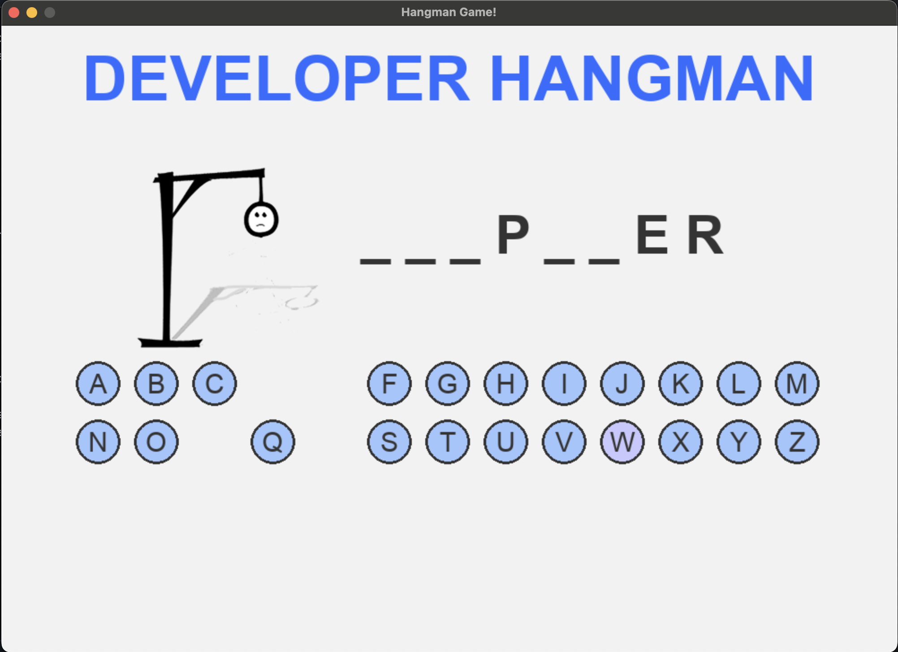

# Hangman Game in Python

## Description

A Hangman game written in Python using the `pygame`, `math` and `random` libraries. The game involves guessing hidden words based on available letters. The player has a limited number of attempts, losing one each time they guess a wrong letter.

The game features a visual representation of the hangman being drawn as the playermakes incorrect guesses and allowa the player to interact with the game by clicking on the letters.

## Requirements

- Python 3.x
- pygame library

## Installation

1. Clone the repository to your local machine
   ```bash
   git clone https://github.com/jenny102292/hangman_game.git

2. Navigate to the project directory:
  
   ```bash
   cd hangman_game

3. Install the Pygame library
   ```bash
   pip install pygame

4. Download the words.txt file containing words to guess. You can add you own words to this file to change the word list in the game.

## Running the Game

To run the game, simply execute the script:
```bash
python hangman_game.py
```
This will open a window where you can click on letters to guess the word. The game ends either when you win, lose or close the window.

## Game Rules

1. The player has to guess a word which is represented by inderscores (_).
2. The player clicks on letters to guess the word.
3. Each incorrect guess draws part of the hangman and the game ends after 6 wrong attempts.
4. The game also ends when the player guesses all the letters in the word correctly.

After the game ends the player is asked if they want to play again.


## Game Features

* #### Interactive Buttons:
  The user can click on letters to guess them.
* #### Hangman Visualization:
  The game show the stages of the hangman being drawn for each wrong guess.
* #### Points for Correct Guesses:
  Correct guesses reveal the letter in the word.
* #### Play Again Option:
  After the game (win or loss) the player can decide whether to play again.

## Project Contents
* #### hangman_game.py:
  Main game logic using Pygame, handling user interaction and drawing the game screen.
* #### words.txt:
  A file containing a list words to be guessed. Words are chosen randomly each round.
* #### images/hangman0.png, hangman1.png, ..., hangman6.png:
  Images representing each stage of the hangman.
* #### README.md:
  Project documentation.


## Example Image


